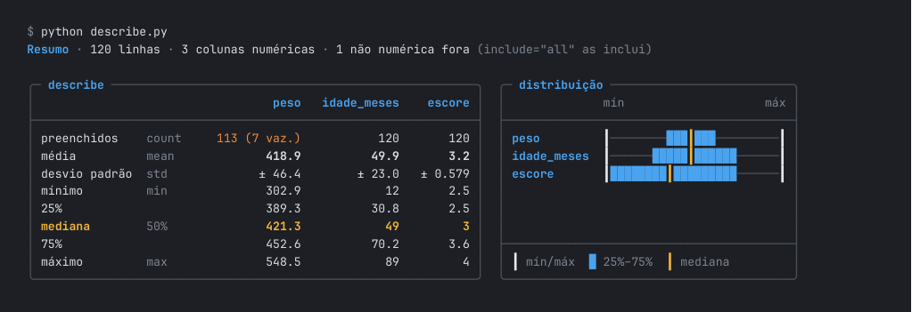
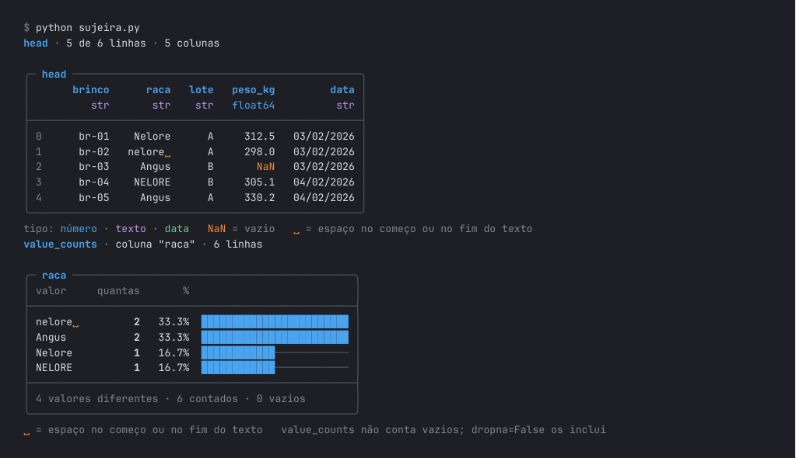
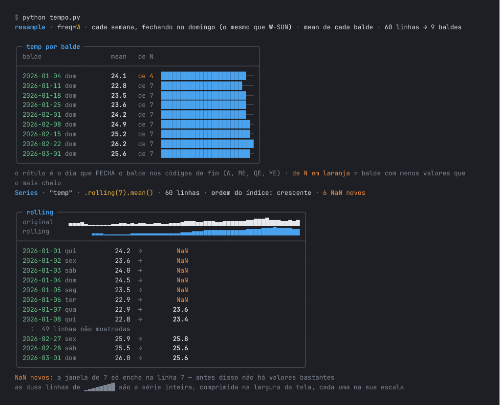

# rattlesnake

**O chocalho do pandas no terminal.** O `print` do pandas, relido — sem mudar uma linha do seu código.

```python
print(df.describe())      # você escreve exatamente o que já escrevia
```



O comando se chama `ratt`. Ele liga a releitura num ambiente Python, e a partir dali todo
`python x.py` daquele ambiente mostra a saída do pandas assim: medidas em português ao lado do
nome original, os vazios em laranja, a distribuição em barras, o que mudou depois de um filtro.

## Por que cascavel

O chocalho existe para **avisar antes**. É o que a releitura faz com o que o pandas imprime e
ninguém vê: o espaço sobrando em `"nelore "`, o peso que está vazio, o `count` que não é o número
de linhas, a semana que falta num índice de datas, o "de N" que uma média não conta.

Ela avisa — **não decide**. Nenhum template diz "use a mediana" ou "essa coluna é assimétrica":
ela mostra os fatos que levam a uma conclusão, e a conclusão é de quem lê.

## O que muda e o que não muda

- **Os comandos não mudam.** `print(df.describe())` continua sendo `print(df.describe())`.
- **É só visual.** O objeto que o pandas devolve é o mesmo; nada é recalculado nem alterado.
- **O nome original fica à vista.** `média` vem ao lado de `mean`, `mediana` ao lado de `50%`:
  o pandas cru continua legível em qualquer outra máquina.
- **Só no terminal.** Redirecionou para arquivo (`python x.py > saida.txt`)? Sai o texto original.
- **Nunca come uma saída.** Se algo falhar dentro da releitura, o `print` original roda.

## Instalação

São dois passos: instalar o comando, e ligar a releitura onde você quer.

**1. O comando `ratt`**, uma vez por máquina:

```bash
pipx install git+https://github.com/GF-Linux/rattlesnake.git
# sem pipx:
python3 -m pip install --user git+https://github.com/GF-Linux/rattlesnake.git
```

**2. Ligar** — em um projeto, ou no seu usuário:

```bash
cd meu-projeto
python -m venv .venv          # se o projeto ainda não tem ambiente virtual
ratt install                  # liga só aqui

ratt install --global         # liga no python3 do seu usuário, em qualquer pasta
```

| | onde liga | vale para |
|---|---|---|
| `ratt install` | o ambiente virtual da pasta (`.venv/`, `venv/`, `env/`) ou o ativo | só quem usa aquele ambiente |
| `ratt install --global` | a pasta de pacotes do usuário daquele Python | aquele Python em qualquer pasta — **menos dentro de um ambiente virtual**, que existe justamente para isolar isso |

**pyenv:** uma pasta que só tem `.python-version` escolhe o *interpretador*, mas não isola
pacotes — eles são compartilhados por todo projeto da mesma versão. Por isso o `ratt install`
recusa e explica; crie um `.venv` na pasta, ou use `--global` sabendo que vale para a versão
inteira.

**distrobox / toolbox:** o container enxerga a mesma pasta pessoal, mas o Python de dentro é
outro. Instale o `ratt` e rode `ratt install` também lá dentro.

## Comandos

```
ratt                     sem nada, num terminal, abre o menu
ratt -h                  a ajuda (ratt <comando> -h: a de um comando)
ratt install [--global]  liga a releitura
ratt uninstall           desliga  (--global · --all: de todo lugar)
ratt status              onde está ligada, em que versão, e se esta pasta tem
ratt templates           o que é relido, e como aparece
ratt check-update        procura uma versão nova e mostra o que mudou
ratt upgrade             procura, mostra o que mudou e pergunta [s/N] antes de instalar
ratt sync                reescreve a releitura em todo lugar, com a versão deste ratt
```

O `upgrade` segue o espírito do `dnf upgrade --refresh`: busca a versão no repositório, mostra
as novidades deste [CHANGELOG](CHANGELOG.md), pergunta, atualiza o `ratt` do jeito que ele foi
instalado (pipx ou pip) e reaplica a releitura em todo lugar onde ela está ligada.

## O que é relido

`ratt templates` mostra a lista inteira. Em resumo:

| grupo | comandos |
|---|---|
| inspeção | `shape`, `describe` (números e texto), `head`/`tail`/`sample`, `print(df)`, `print(df["col"])`, `dtypes`, `columns`, `index`, `isna().sum()`, `nunique()`, `value_counts()` (contagem e proporção), `unique()` |
| transformação | filtros, e **qualquer** tabela ou coluna transformada (`sort_values`, `dropna`, `merge`, `.str`, `fillna`…): o que mudou em linhas, ordem, colunas e vazios; reduções (`mean`, `sum`…) com o "de N" |
| agrupamento | `groupby` (uma e duas chaves, `agg`), `pivot_table`/`unstack`, `crosstab`, `corr`, `pd.cut`/`pd.qcut` |
| tempo | `to_datetime`, `.dt`, índice de datas (ordem, passo, buracos, ritmo), `date_range`, `to_period`, `resample` com o "de N", `rolling`/`diff`/`shift`/`pct_change` |

A sujeira que o pandas não mostra:



O tempo, com a série inteira numa linha e o balde incompleto avisado:



Saem como o pandas escreve: o `info()`, números soltos (`print(df["x"].mean())`), tabelas com
índice de vários níveis e `print` com mais de uma coisa (`print("total:", df.shape)`).

## Desligar

```bash
RATT=0 python x.py           # o pandas cru, nesta execução
python x.py > saida.txt      # fora do terminal, já sai cru
ratt uninstall               # desliga do ambiente desta pasta
ratt uninstall --all         # de todo lugar
```

## Como funciona

O `ratt install` grava **dois arquivos** na pasta de pacotes do Python escolhido, e mais nada:

- `ratt_releitura.py` — a releitura, com a versão no topo;
- `ratt.pth` — uma linha que o Python lê ao começar: `import ratt_releitura; ratt_releitura.ligar()`.

`ligar()` troca o `print` daquele processo por um que olha o que vai ser impresso. Se é um
objeto do pandas, a saída é um terminal, e a linha que você escreveu é de um comando que tem
template, ele escreve a releitura; senão, chama o `print` original. Para mostrar números que a
saída do pandas não traz (o total de linhas, os vazios fora de um `value_counts`), ele **lê** o
`df` que aparece logo depois do `print(` — lê, nunca executa.

O `ratt` lembra onde instalou em `~/.local/share/ratt/instalacoes.json` (ou `$XDG_DATA_HOME/ratt`),
para o `status`, o `sync` e o `upgrade`.

## Limites conhecidos

- Os números extras dependem do `df` estar na mesma linha do `print`. Com `desc = df.describe()`
  e depois `print(desc)`, a tabela sai relida, mas sem o "(6 vaz.)".
- Um `print` que ocupa várias linhas de código pode não ser reconhecido, e sai cru.
- No Debian/Ubuntu existe um pacote não relacionado também chamado `ratt` ("Rebuild All The
  Things"). Se os dois estiverem instalados, vale o que vier primeiro no `PATH`.
- Testado no Fedora 44 com Python 3.14 e pandas 3.0.6. Os textos estão em português.

## Testes

```bash
python -m pytest tests        # ou: python tests/test_ratt.py
```

O teste roda `tests/exemplos/tudo.py` — que passa por todos os templates — dentro de um terminal
de mentira (pty), e confere que no terminal sai relido, fora dele sai o pandas, e com `RATT=0`
nada muda. Precisa de um Python com pandas.

## Licença

MIT.
